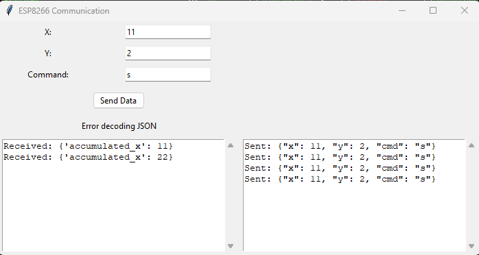

# ESP8266 Communication with PC

This project demonstrates communication between an ESP8266 and an Arduino Mega using Python (Tkinter) for the GUI on the PC side. The Arduino Mega sends JSON-formatted data to the ESP8266, which displays the received data in a Tkinter GUI and sends back a response.

## Dependencies

- **Python:** Ensure you have Python installed. You can download it from [python.org](https://www.python.org/).

- **Tkinter:** Tkinter is included with Python, so no additional installation is needed.

- **PySerial:** Install PySerial using the following command:
  ```bash
  pip install pyserial

ArduinoJson Library: Install the ArduinoJson library for Arduino. You can install it through the Arduino Library Manager.
##Setup
Arduino Mega
Open the mega.ino file in the Arduino IDE.

Install the ArduinoJson library if not already installed.

Upload the code to your Arduino Mega.

ESP8266
Open the esp8266.py file in a Python IDE or text editor.

Modify the serial port (COM6 in this example) in the line:

python

ser = serial.Serial("COM6", 921600, timeout=0.1)
Run the Python script.

Usage
Run the Python script for the ESP8266.

Input the values for X, Y, and Command in the Tkinter GUI.

Click the "Send Data" button to send the data to the Arduino Mega.

View the sent and received data side by side in the Tkinter GUI.

Arduino Code Explanation
The Arduino Mega code (mega.ino) sends JSON-formatted data containing x, y, and cmd.

The ESP8266 code (esp8266.py) reads the data, displays the received data, and sends a response with an accumulated x value back to the Mega.