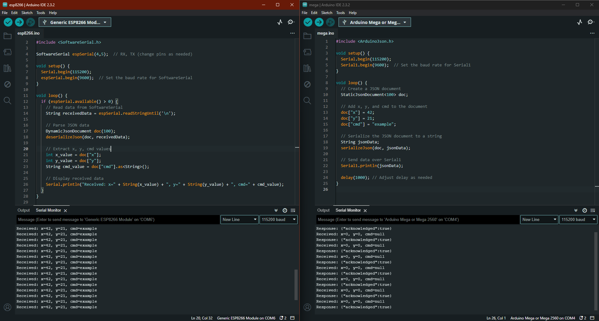

# ESP32 <-> Arduino MEGA (JSON)

## Setup

1. Clone the repository to your local machine.
2. Navigate to the project directory.
3. Install the necessary dependencies (if any).
   

## Connecting ESP8266 and Arduino MEGA

1. Connect the D1 pin on the ESP8266 to the TX1 pin on the Arduino MEGA.
2. Connect the D2 pin on the ESP8266 to the RX1 pin on the Arduino MEGA.

## Running the Code

1. Open the project in your preferred IDE.
2. Build and upload the code to your Arduino MEGA.

## Troubleshooting

If you encounter any issues, please check your wiring connections and ensure that the correct board and port are selected in your IDE.
